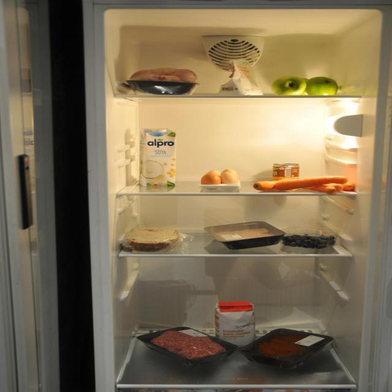

# Smart Fridge Recipe Assistant

The Smart Fridge Recipe Assistant combines Roboflow-powered ingredient detection with a multi-stage recipe recommendation engine. Upload a photo of your fridge and instantly receive recipe ideas that respect your dietary preferences, nutritional goals, and ingredient availability.



## Features

- **Visual ingredient detection** – Uses a Roboflow YOLO model to detect fridge items, annotate the photo, and build a structured ingredient payload.
- **Robust recipe ranking pipeline** – Performs coarse ranking, ML reranking, and clustering-based diversification using pretrained user profiles.
- **Personalized dietary controls** – Configure vegetarian style, allergies, preferred cuisines, macro ranges, and cooking time caps directly in the UI.
- **Interactive feedback loop** – Record positive feedback for recommended recipes to continuously refine personal models.
- **One-click examples** – Try the demo instantly with bundled sample fridge photos.

## Project structure

```
smartFridge/
├── app.py                     # Gradio user interface
├── frige_detect/              # Roboflow detector & demo assets
│   ├── detect.py
│   ├── demo/
│   └── roboflow_credentials.txt
├── recipe_recommendation/     # Recommendation engine
│   ├── main.py
│   ├── src/
│   └── user_data/
├── requirements.txt
└── README.md
```

## Installation

1. Create a new Python environment (recommended).
2. Install dependencies:

   ```bash
   pip install -r requirements.txt
   ```

The Roboflow API key and project information used by the detector are stored in `frige_detect/roboflow_credentials.txt` and loaded automatically; no manual input is required.

## Running the app locally

```bash
python app.py
```

This command launches a Gradio interface. In the browser you can:

1. Upload a fridge image or click one of the example thumbnails.
2. Adjust dietary preferences, allergy lists, region preferences, and nutrition goals.
3. Click **“Analyze fridge & recommend recipes”** to trigger detection and recommendation.
4. Inspect the annotated fridge photo, detection payload, mapped ingredients, and the top recipes.
5. (Optional) Select a favourite recipe and press **“Save feedback”** to log positive feedback for the active user profile.

All user profiles and feedback files are stored under `recipe_recommendation/user_data/<user_id>/`.

## Dataset & models

- Ingredient mappings and recipe datasets are fetched on demand from the Hugging Face dataset [`Iris314/recipe-cleaned`](https://huggingface.co/datasets/Iris314/recipe-cleaned).
- Ranking models are kept per user and automatically bootstrapped or copied from similar users when needed.

## Deploying to Hugging Face Spaces

Once the app is running locally, you can deploy it to Hugging Face Spaces by creating a new Space, uploading this repository, and configuring the Space to run `python app.py`. No extra environment variables are required beyond the bundled Roboflow credentials.

## License

This project bundles third-party datasets and models subject to their respective licenses. Please review the Roboflow terms of service and the Hugging Face dataset license before commercial use.
